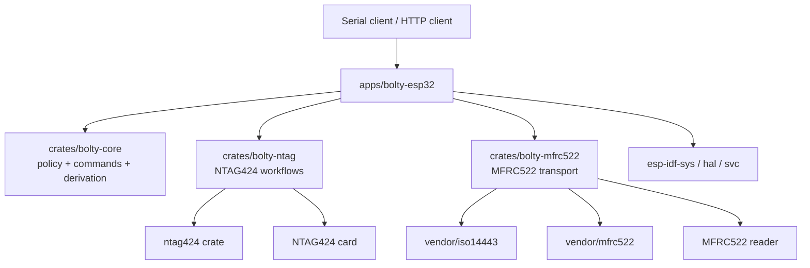

# bolty-rs

`bolty-rs` is a Rust-native Bolt Card firmware workspace for ESP32 devices using an MFRC522 NFC frontend. The current supported boards are **M5StickC Plus** and **M5Atom Matrix**, both wired to MFRC522 over I2C. The project is serial-driven by default, with optional WiFi/REST/OTA support behind feature flags.

## Current state

- Core Bolt Card workflows are implemented: `inspect`, `check`, `burn`, `wipe`, key staging, issuer staging, URL staging, and status/UID inspection.
- Both currently supported boards build and run from the same firmware crate with compile-time board selection.
- WiFi/REST/OTA are optional capabilities, not baseline requirements.
- Dependency versions are pinned exactly and the workspace `Cargo.lock` is intended to be tracked for reproducible firmware builds.

## Workspace architecture



See also [`docs/architecture.md`](docs/architecture.md) and [`docs/parity-matrix.md`](docs/parity-matrix.md).

## Supported boards and capability model

| Board feature | Current NFC frontend | Capability features implied | Notes |
|---|---|---|---|
| `board-m5stick` | `nfc-mfrc522` | `display-st7789` | M5StickC Plus + MFRC522 on G32/G33 |
| `board-m5atom` | `nfc-mfrc522` | `led-matrix` | M5Atom Matrix + MFRC522 on G26/G32 |

Additional optional runtime services:

| Feature | Meaning |
|---|---|
| `wifi` | Enable WiFi connect/disconnect commands |
| `rest` | Enable REST API (implies `wifi`) |
| `ota` | Enable OTA update command (implies `wifi`) |

`display-st7789` is currently a **capability gate**, not a shipped UI implementation yet. It exists so the board/capability model is explicit before display support lands. Future NFC frontends such as PN532 should follow the same pattern as a separate frontend capability rather than being hidden inside board selection.

## Build and flash

Always build the application package explicitly from the workspace root:

```bash
# M5StickC Plus
cargo +esp build --release -p bolty-esp32 --features "board-m5stick"
espflash flash --port /dev/ttyUSB1 target/xtensa-esp32-espidf/release/bolty-esp32

# M5StickC Plus with WiFi + REST
cargo +esp build --release -p bolty-esp32 --features "board-m5stick,wifi,rest"
espflash flash --port /dev/ttyUSB1 target/xtensa-esp32-espidf/release/bolty-esp32

# M5Atom Matrix
cargo +esp build --release -p bolty-esp32 --features "board-m5atom"
espflash flash --port /dev/ttyUSB0 target/xtensa-esp32-espidf/release/bolty-esp32
```

Exactly one board feature must be enabled for firmware builds.

## REST and network discovery

When built with `wifi,rest`, the device exposes an HTTP API and advertises itself over mDNS as `bolty.local`.

Typical Linux discovery commands:

```bash
# Resolve the hostname (requires Avahi or another mDNS resolver)
avahi-resolve -n bolty.local

# Browse advertised HTTP services
avahi-browse -r _http._tcp

# Broadcast DNS-SD discovery with nmap
nmap --script broadcast-dns-service-discovery
```

If `bolty.local` does not resolve, verify that the host has mDNS enabled (`avahi-daemon` or `systemd-resolved`) and that UDP/5353 is not blocked. Do not confuse the router address with the device address; `192.168.13.1` is typically the gateway, not the ESP32.

## Repository hygiene and dependency policy

- Direct dependency versions are pinned with `=x.y.z` syntax.
- The workspace `Cargo.lock` should be committed to freeze transitive versions for reproducible firmware builds.
- Local files such as `.env`, `.env.*`, `.direnv/`, `.envrc`, `.embuild/`, and editor caches are ignored.
- WiFi credentials must never be committed. Use runtime serial commands or local ignored files only.

## Improvement areas already identified

- Add the actual `display-st7789` implementation for M5StickC Plus using a lightweight driver stack.
- Add timeout hardening in vendored MFRC522/ISO14443 loops before expanding hardware support.
- Keep reducing implicit behavior in the firmware loop and serial console FFI edges.
- Introduce a separate PN532 frontend when that transport is added, rather than overloading board features.
