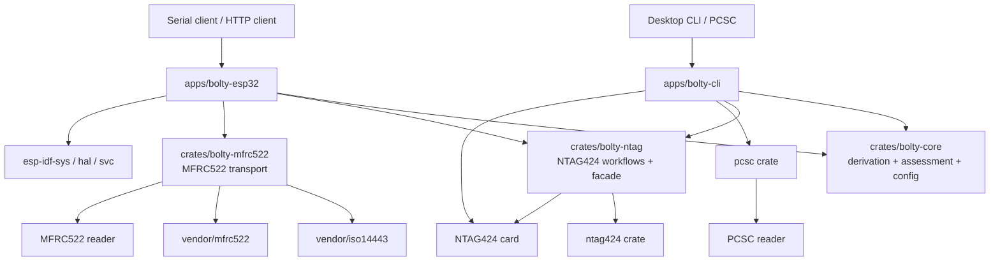

# bolty-rs

`bolty-rs` is a Rust-native Bolt Card workspace targeting **both** ESP32 firmware (MFRC522 NFC frontend) and desktop CLI (PCSC smart card readers). The ESP32 firmware supports **M5StickC Plus** and **M5Atom Matrix**, both wired to MFRC522 over I2C. The desktop CLI (`bolty-cli`) provides card programming operations via any PC/SC reader on Linux/macOS. The project is serial-driven by default, with optional WiFi/REST/OTA support behind feature flags.

## Current state

- Full Bolt Card lifecycle: `burn`, `wipe`, `diagnose`, `inspect`, `keyver`, `ver`, `picc`, `url`, `derive-keys`, `cycle`, `try-key`, `scan-keys`
- Desktop CLI (`bolty-cli`) with pre-flight safety checks, per-key verification, `--dry-run` mode, and card recovery tools
- ESP32 firmware with serial console, optional WiFi/REST API (port 80, mDNS as `bolty.local`), and OTA updates
- Comprehensive hardware-free test suite including integration tests via MockTransport (full NTAG424 protocol simulation)
- Both supported boards (M5StickC Plus, M5Atom Matrix) build from the same firmware crate with compile-time board selection
- Hardware-verified on PCSC (ACS ACR1252) and M5StickC Plus (MFRC522 I2C)
- Dependency versions pinned exactly, `Cargo.lock` tracked for reproducible builds

## Workspace architecture



See also [`docs/architecture.md`](docs/architecture.md) and [`docs/parity-matrix.md`](docs/parity-matrix.md).

## Supported boards and capability model

| Board feature | Current NFC frontend | Capability features implied | Notes |
|---|---|---|---|
| `board-m5stick` | `nfc-mfrc522` | `display-st7789` | M5StickC Plus + MFRC522 on G32/G33 |
| `board-m5atom` | `nfc-mfrc522` | `led-matrix` | M5Atom Matrix + MFRC522 on G26/G32 |

Additional optional runtime services:

| Feature | Meaning |
|---|---|
| `wifi` | Enable WiFi connect/disconnect commands |
| `rest` | Enable REST API (implies `wifi`) |
| `ota` | Enable OTA update command (implies `wifi`) |

`display-st7789` is currently a **capability gate**, not a shipped UI implementation yet. It exists so the board/capability model is explicit before display support lands. Future NFC frontends such as PN532 should follow the same pattern as a separate frontend capability rather than being hidden inside board selection.

## Build and flash

Always build the application package explicitly from the workspace root:

```bash
# M5StickC Plus
cargo +esp build --release -p bolty-esp32 --features "board-m5stick"
espflash flash --port /dev/ttyUSB1 target/xtensa-esp32-espidf/release/bolty-esp32

# M5StickC Plus with WiFi + REST
cargo +esp build --release -p bolty-esp32 --features "board-m5stick,wifi,rest"
espflash flash --port /dev/ttyUSB1 target/xtensa-esp32-espidf/release/bolty-esp32

# M5Atom Matrix
cargo +esp build --release -p bolty-esp32 --features "board-m5atom"
espflash flash --port /dev/ttyUSB0 target/xtensa-esp32-espidf/release/bolty-esp32
```

Exactly one board feature must be enabled for firmware builds.

## Desktop CLI (bolty-cli)

`bolty-cli` provides card programming operations via any PC/SC reader (e.g. ACS ACR1252). It requires `libpcsclite-dev` on Linux or `pcsc-lite` on macOS.

```bash
# Install pcsc dependency (Ubuntu)
sudo apt install libpcsclite-dev

# Build
cargo build -p bolty-cli

# Diagnose card state (read-only, safe)
cargo run -p bolty-cli -- diagnose --issuer-key 00000000000000000000000000000001

# Preview burn without touching the card
cargo run -p bolty-cli -- burn --issuer-key <KEY> --url <URL> --dry-run

# Burn card (writes NDEF, enables SDM, installs derived keys)
cargo run -p bolty-cli -- burn --issuer-key <KEY> --url <URL>

# Read key versions (requires K0 auth)
cargo run -p bolty-cli -- keyver --issuer-key <KEY>

# Wipe card (factory reset)
cargo run -p bolty-cli -- wipe --issuer-key <KEY>

# Card recovery: try a specific raw key
cargo run -p bolty-cli -- try-key --key 11111111111111111111111111111111

# Card recovery: scan all likely key candidates
cargo run -p bolty-cli -- scan-keys --issuer-key <KEY>
```

All APDU exchanges are logged to `/tmp/bolty-audit.log`. See [`docs/card-safety.md`](docs/card-safety.md) for the complete safety reference.

## REST and network discovery

When built with `wifi,rest`, the device exposes an HTTP API and advertises itself over mDNS as `bolty.local`.

Typical Linux discovery commands:

```bash
# Resolve the hostname (requires Avahi or another mDNS resolver)
avahi-resolve -n bolty.local

# Browse advertised HTTP services
avahi-browse -r _http._tcp

# Broadcast DNS-SD discovery with nmap
nmap --script broadcast-dns-service-discovery
```

If `bolty.local` does not resolve, verify that the host has mDNS enabled (`avahi-daemon` or `systemd-resolved`) and that UDP/5353 is not blocked. Do not confuse the router address with the device address; `192.168.13.1` is typically the gateway, not the ESP32.

## Repository hygiene and dependency policy

- Direct dependency versions are pinned with `=x.y.z` syntax.
- The workspace `Cargo.lock` should be committed to freeze transitive versions for reproducible firmware builds.
- Local files such as `.env`, `.env.*`, `.direnv/`, `.envrc`, `.embuild/`, and editor caches are ignored.
- WiFi credentials must never be committed. Use runtime serial commands or local ignored files only.

## Improvement areas already identified

- Re-enable `display-st7789` and verify NFC + display coexist on M5StickC Plus hardware (display driver code exists, feature is wired into `board-m5stick`).
- Add I2C bus recovery (SCL toggle) before `I2cDriver` init for robustness against stuck-bus conditions.
- Add MFRC522 init retry with backoff (currently single attempt; vendor `init()` consumes the bus on failure).
- Introduce a separate PN532 frontend when that transport is added, rather than overloading board features.

## Contributing

See [`docs/CONTRIBUTING.md`](docs/CONTRIBUTING.md) for development setup, git hooks, testing guide, and dual-target workflow. See [`docs/card-safety.md`](docs/card-safety.md) for the NTAG424 safety reference.
