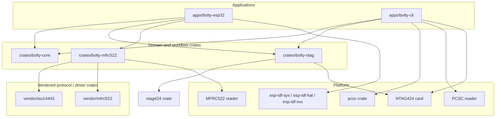
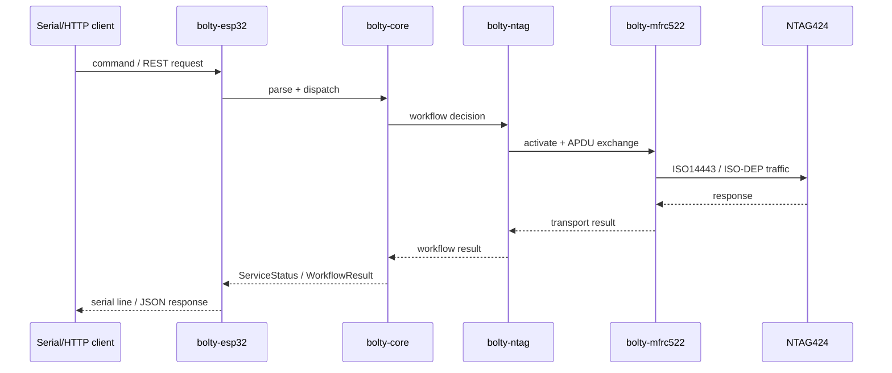

# Architecture

This document describes the current `bolty-rs` workspace shape, the dependency boundaries between crates, and the capability model used by the ESP32 firmware.

## Workspace topology



## Responsibility split

| Crate | Responsibility |
|---|---|
| `bolty-core` | Pure policy, command parsing, derivation, card assessment, RAM-only runtime config |
| `bolty-ntag` | NTAG424-specific card operations (`burn`, `wipe`, `check_key_versions`, etc.) |
| `bolty-mfrc522` | Reader activation and transport glue from MFRC522 to NTAG/ISO-DEP layers |
| `apps/bolty-esp32` | Board selection, serial loop, WiFi/REST/OTA integration, hardware bootstrapping |
| `apps/bolty-cli` | Desktop CLI via PCSC — burn, wipe, diagnose, picc, keyver, ver, inspect, cycle |
| `vendor/iso14443` | Vendored ISO/IEC 14443 protocol support |
| `vendor/mfrc522` | Vendored and patched MFRC522 low-level driver |

## Runtime flow



## Board and capability model

The firmware crate uses **board features** to choose pins and **capability features** to describe what the selected board exposes.

| Feature | Role | Current meaning |
|---|---|---|
| `board-m5atom` | board selector | M5Atom Matrix with MFRC522 on G26/G32 |
| `board-m5stick` | board selector | M5StickC Plus with MFRC522 on G32/G33 |
| `nfc-mfrc522` | frontend capability | Current reader transport |
| `led-matrix` | board capability | M5Atom-only NeoPixel matrix |
| `display-st7789` | board capability | M5Stick display capability slot |
| `wifi` | optional service | WiFi command support |
| `rest` | optional service | HTTP API, implies `wifi` |
| `ota` | optional service | OTA command, implies `wifi` |

Today, both supported boards imply `nfc-mfrc522`. Future frontends such as PN532 should be added as separate frontend capability features rather than folded into board logic.

## Dependency policy

- Direct dependencies are pinned to exact resolved versions using `=x.y.z` syntax.
- The workspace lockfile is expected to be committed for reproducible firmware builds.
- Vendored crates remain vendored, but their own direct dependencies are also pinned.

## Networking and discovery

When `wifi,rest` are enabled, the firmware:

1. Connects to WiFi.
2. Starts the REST server.
3. Advertises `bolty.local` over mDNS.
4. Publishes an `_http._tcp` service with a TXT record pointing to `/api/status`.

Linux-side discovery should prefer mDNS tools before subnet scanning:

```bash
avahi-resolve -n bolty.local
avahi-browse -r _http._tcp
nmap --script broadcast-dns-service-discovery
```

## Transport abstraction

All card operations are generic over `T: ntag424::Transport`. This enables
the same burn/wipe/diagnose workflows to run on ESP32 firmware, desktop CLI,
and integration tests.

| Transport | Target | Purpose |
|---|---|---|
| `PcscTransport` | Desktop (bolty-cli) | PC/SC reader via `pcsc` crate |
| MFRC522 transport | ESP32 (bolty-esp32) | ISO-DEP over MFRC522 I2C/SPI |
| `MockTransport` | Integration tests | Full NTAG424 protocol simulation |
| `LoggingTransport<T>` | Any | Wraps any transport with APDU audit logging to `/tmp/bolty-audit.log` |

`MockTransport` simulates AES-EV2 authentication, file settings read/write,
key change, key version read, NDEF read/write, and GetVersion — enabling 11
hardware-free integration tests covering the complete card lifecycle.

## Improvement backlog

1. Add the actual ST7789 display implementation behind `display-st7789`.
2. Add timeout hardening in vendored MFRC522 and ISO14443 loops.
3. Further reduce ignored formatting/write failures in the serial and JSON output paths.
4. Add a separate PN532 transport crate and frontend capability when that hardware path is introduced.
5. DRY refactor: delegate CLI burn/wipe to `bolty-ntag::burn()`/`wipe()` after adding safety features (SDM clearing, NDEF verification, post-burn auth check) to the library implementations.
6. Per-key verification: verify each K1-K4 individually after install, before K0 change.
