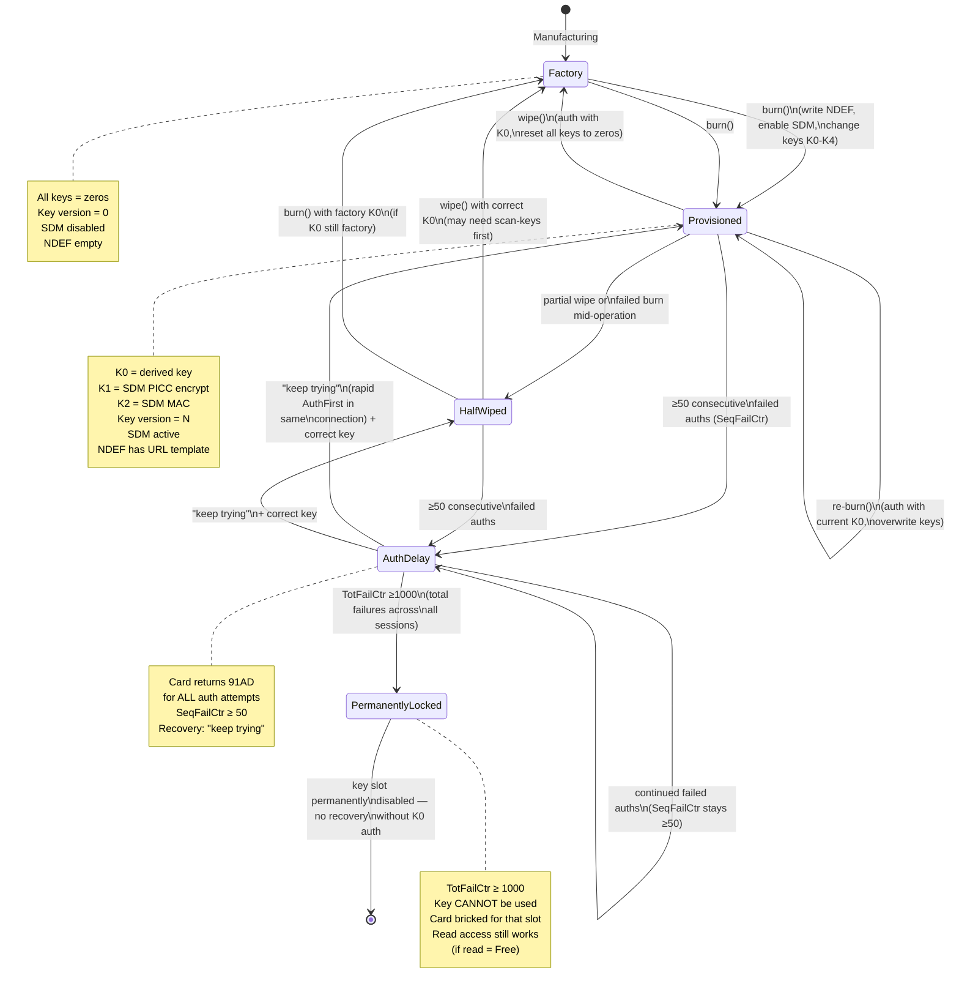
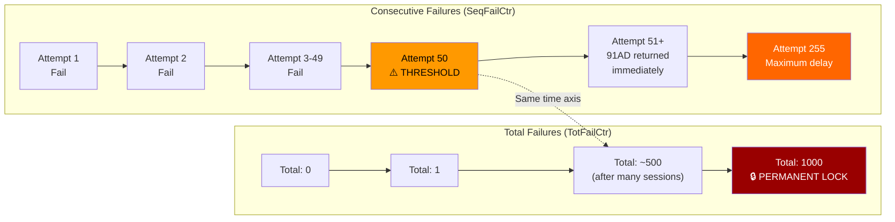
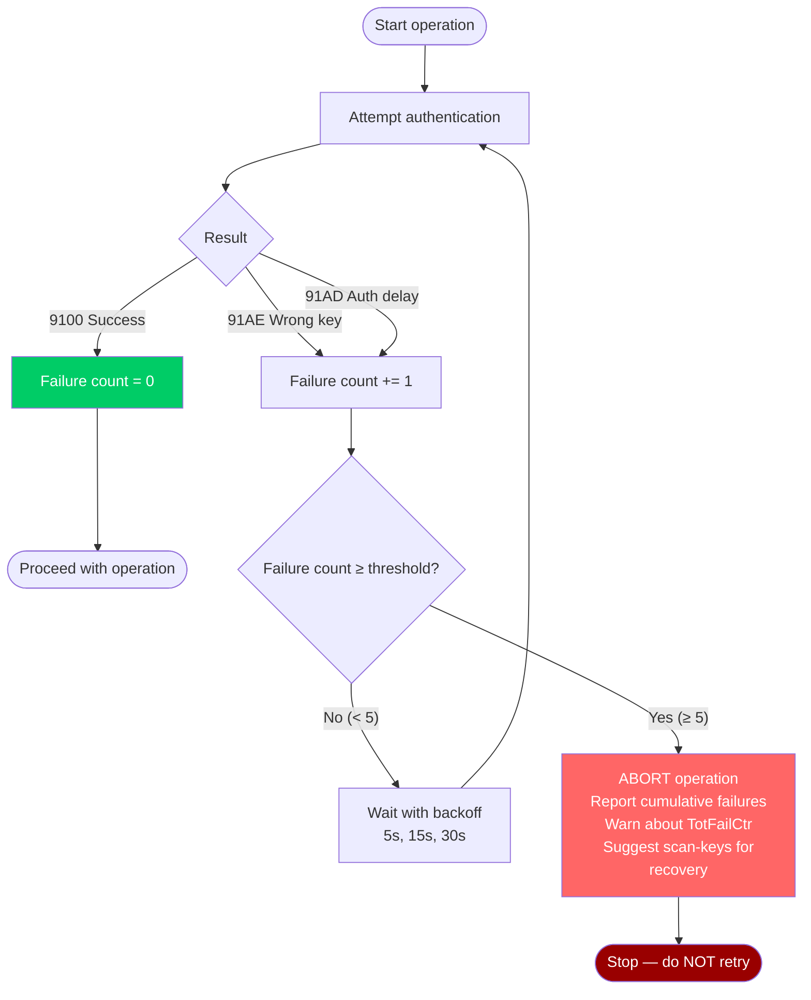

# NTAG424 DNA Authentication & Failure Handling

Complete reference for understanding NTAG424 DNA authentication, failure
counters, auth delay, and the circuit breaker pattern needed for safe card
operations.

## 1. Authentication Protocol

NTAG424 DNA uses AES-128 (ISO/IEC 10118-2) in a 3-pass mutual authentication
protocol based on DESFire EV2. The reader proves knowledge of the key without
revealing it.

### 1.1 AuthFirst (command 0x71)

```
Reader → Card:  90 71 00 00 02 [KeyNo] [KeyVer]
```

- `KeyNo` = which key slot (0-4; 0 = master key K0)
- `KeyVer` = key version (0x00 = "use currently active version")

### 1.2 Card Response to AuthFirst

The card checks the **failure counters** BEFORE processing:

| Counter State | Response | Meaning |
|---|---|---|
| SeqFailCtr < 50 | `91 AF` + encrypted RndB (16 bytes) | Challenge accepted — proceed |
| SeqFailCtr ≥ 50 | `91 AD` | Auth delay — card refuses to process |

If the card returns `91AF`, it has generated a random number `RndB`, encrypted
it with the requested key, and sent it to the reader. The reader must now prove
it can decrypt RndB and produce a valid response.

### 1.3 AuthNext (command 0xAF)

```
Reader → Card:  90 AF 00 00 20 [32-byte response]
```

The reader decrypts RndB, generates `RndA`, and sends `RndA || RndB'` (both
rotated and encrypted). The card verifies the response.

### 1.4 Card Response to AuthNext

| Result | SW code | Meaning |
|---|---|---|
| Correct key | `91 00` + encrypted RndA' (16 bytes) | **Success** — session established |
| Wrong key | `91 AE` | **Authentication error** — key doesn't match |

On `91AE` (wrong key):
- **SeqFailCtr** increments by 1
- **TotFailCtr** increments by 1
- After the next `AuthFirst`, if SeqFailCtr ≥ 50, the card returns `91AD`

On `9100` (success):
- **SeqFailCtr** resets to 0
- **TotFailCtr** decreases by `TotFailCtrDecr` (default: 10)

### 1.5 Status Code Summary

| SW1 SW2 | Name | When | Counters Affected |
|---|---|---|---|
| `91 00` | Operation OK | Auth success, or any successful command | SeqFailCtr → 0, TotFailCtr -= 10 |
| `91 AF` | Additional Frame | AuthFirst accepted, waiting for AuthNext | None |
| `91 AE` | Authentication Error | AuthNext with wrong key | SeqFailCtr += 1, TotFailCtr += 1 |
| `91 AD` | Authentication Delay | AuthFirst when SeqFailCtr ≥ 50 | None (blocked before processing) |

## 2. Failure Counter System

NTAG424 maintains three per-key counters. Each key slot (K0-K4) has its own
independent set (verified empirically in T6 — 10 K0 failures do not affect
K1 auth). These are defined in AN12196 §7.4.

### 2.1 The Three Counters

```
┌─────────────────────────────────────────────────────────────┐
│                    Per-Key Counter Set                       │
│                                                              │
│  ┌─────────────┐  ┌─────────────┐  ┌─────────────┐         │
│  │ SeqFailCtr  │  │ TotFailCtr  │  │ SpentTimeCtr│         │
│  │  (1 byte)   │  │ (2 bytes)   │  │ (2 bytes)   │         │
│  │  Range 0-255│  │ Range 0-1000│  │ Time in FWT │         │
│  └──────┬──────┘  └──────┬──────┘  └──────┬──────┘         │
│         │                │                │                  │
│  Trigger: 50             │           Tracks delayed         │
│  → auth delay (91AD)     │           response time          │
│                    Trigger: 1000                             │
│                    → PERMANENT KEY LOCK                      │
└─────────────────────────────────────────────────────────────┘
```

### 2.2 Counter Behavior Detail

#### SeqFailCtr — Sequential Failure Counter (1 byte)

Tracks **consecutive** failures since the last successful authentication.

| Event | Action |
|---|---|
| Failed auth (`91AE`) | SeqFailCtr += 1 |
| Successful auth (`9100`) | SeqFailCtr = 0 |
| `Cmd.ChangeKey` | SeqFailCtr = 0 |

**Threshold behavior:**
- **0-49**: Normal operation. AuthFirst returns `91AF` (challenge).
- **50-255**: Auth delay active. AuthFirst returns `91AD`. The card says:
  "Keep trying until full delay is spent" (NT4H2421Gx datasheet §10.4).

**Non-volatile (EEPROM):** SeqFailCtr persists across power cycles and RF field
removal. Power cycling the reader does NOT clear it. Physical card removal does
NOT clear it. The delay is NOT time-based — waiting does not clear it.

**Recovery: "Keep trying"** — the NT4H2421Gx product data sheet states for
AUTHENTICATION_DELAY (0xAD): *"Currently not allowed to authenticate. Keep
trying until full delay is spent."*

This means the reader must send AuthFirst **repeatedly within the same PCSC
connection** (not new connections). Each attempt "spends" part of the delay.
Empirically verified: 2-5 rapid AuthFirst commands within a single connection
clears the delay. Each new PCSC connection resets the delay state, so
creating a new connection per retry does NOT work.

#### TotFailCtr — Total Failure Counter (2 bytes)

Tracks **total** failures across the card's lifetime (per key slot).

| Event | Action |
|---|---|
| Failed auth (`91AE`) | TotFailCtr += 1 |
| Successful auth (`9100`) | TotFailCtr -= TotFailCtrDecr (default: 10) |
| `Cmd.ChangeKey` | TotFailCtr = 0 |

**Threshold:**
- `TotFailCtrLimit` (default: **1000**) → **key permanently disabled**
- Once TotFailCtr reaches the limit, the key can **never** be used for
  authentication again. The card is bricked for that key slot.
- Only `Cmd.ChangeKey` can reset TotFailCtr — but ChangeKey requires successful
  K0 auth first. If K0 itself is locked, there is no recovery.

**Non-volatile (EEPROM):** Persists across power cycles. This is why ChangeKey
explicitly resets it — it wouldn't need to if it were volatile.

#### SpentTimeCtr — Spent Time Counter (2 bytes)

Tracks cumulative time spent in delayed responses during auth delay.

| Event | Action |
|---|---|
| Delayed response | SpentTimeCtr += SpentTimeUnit |
| `Cmd.ChangeKey` | SpentTimeCtr = 0 |

`SpentTimeUnit` depends on the Frame Waiting Time (FWT) configuration.

### 2.3 Counter Reset Matrix

| Action | SeqFailCtr | TotFailCtr | SpentTimeCtr |
|---|---|---|---|
| Successful auth | → 0 | -= 10 | unchanged |
| "Keep trying" (rapid AuthFirst in same connection) | delay clears | unchanged | increases |
| Power cycle (reader unplug, card removal) | **unchanged** | unchanged | unchanged |
| `Cmd.ChangeKey` | → 0 | → 0 | → 0 |
| Waiting (no commands) | **unchanged** | unchanged | unchanged |

> **Critical correction:** SeqFailCtr is NON-VOLATILE. Power cycling does NOT
> clear it. Waiting does NOT clear it. The ONLY recovery is "keep trying" —
> sending AuthFirst repeatedly within the same PCSC connection until the delay
> is "spent" (per NT4H2421Gx datasheet).

## 3. Card Lifecycle States



## 4. Authentication Flow with Failure Paths

```mermaid
flowchart TD
    Start([Reader wants to authenticate]) --> AuthFirst[Send AuthFirst\n90 71 00 00 02 KeyNo KeyVer]

    AuthFirst --> CheckCtrs{Check SeqFailCtr}

    CheckCtrs -->|"≥ 50 (delay active)"| Return91AD[Return 91AD\nAuth Delay]
    CheckCtrs -->|"< 50 (OK)"| GenRndB[Generate RndB\nencrypt with key]
    GenRndB --> Return91AF[Return 91AF + encrypted RndB]

    Return91AF --> ReaderComputes[Reader computes\nresponse using its key]
    ReaderComputes --> AuthNext[Send AuthNext\n90 AF 00 00 20 + 32 bytes]

    AuthNext --> VerifyResp{Card verifies\nreader response}

    VerifyResp -->|"Correct key"| Return9100[Return 9100\nSuccess]
    VerifyResp -->|"Wrong key"| Return91AE[Return 91AE\nAuth Error]

    Return9100 --> ResetSeq[SeqFailCtr = 0\nTotFailCtr -= 10]
    ResetSeq --> SessionEstablished([Session established\ncommands available])

    Return91AE --> IncrSeq[SeqFailCtr += 1\nTotFailCtr += 1]
    IncrSeq --> CheckTotFail{Check TotFailCtr}

    CheckTotFail -->|"≥ 1000"| PermanentLock[⚠️ KEY PERMANENTLY LOCKED\nKey disabled forever\nOnly ChangeKey can reset\nbut requires K0 auth]
    CheckTotFail -->|"< 1000"| ReadyForRetry([Ready for next attempt\nbut SeqFailCtr is climbing])

    Return91AD --> Blocked([Auth blocked\n"Keep trying" — send AuthFirst\nrepeatedly in same connection\nuntil delay is spent])

    style Return91AD fill:#ff9900,color:#000
    style Return91AE fill:#ff6666,color:#fff
    style Return9100 fill:#00cc66,color:#fff
    style PermanentLock fill:#990000,color:#fff
    style SessionEstablished fill:#00cc66,color:#fff
```

## 5. Failure Escalation Timeline

This diagram shows what happens when a bug or user error causes repeated
authentication failures over time:



### 5.1 Realistic Failure Rate Examples

| Scenario | Failures/sec | Time to SeqFailCtr=50 | Time to TotFailCtr=1000 |
|---|---|---|---|
| M5StickC polling bug (pre-fix) | 2/sec | **25 seconds** | 8.3 minutes |
| CLI retry loop (3 retries × 2 keys) | 6/session | 8 sessions | 167 sessions |
| E2e test burn→wipe→burn cycle | ~10/session | 5 sessions | 100 sessions |
| Manual user trying different keys | ~1/min | 50 minutes | 16.7 hours |

### 5.2 The Death Spiral

The most dangerous pattern is a **positive feedback loop**:

```
Wrong key → 91AE → retry → 91AE → ... → SeqFailCtr ≥ 50
                                                    ↓
91AD → code interprets as "try again later" → retries with delay
                                                    ↓
Retries still use wrong key → 91AD → TotFailCtr keeps climbing
                                                    ↓
Eventually TotFailCtr ≥ 1000 → KEY PERMANENTLY LOCKED
```

This is exactly what happened to card UID `043365FA967380` — the M5StickC
polling bug spammed failed auths at 2/second, hitting the SeqFailCtr threshold
in 25 seconds, and accumulating TotFailCtr with each session.

## 6. The Circuit Breaker Pattern

### 6.1 Problem

Without a circuit breaker, code can inadvertently brick a card:

1. A bug in key derivation produces the wrong key
2. Each retry attempt increments the failure counters
3. The code retries "helpfully" with delays, making things worse
4. Eventually TotFailCtr reaches 1000 → permanent lock

### 6.2 Solution

A circuit breaker tracks cumulative authentication failures within a single
CLI invocation (or firmware session) and refuses to continue after a threshold.



### 6.3 Implementation Requirements

1. **Track total failures per CLI invocation** (not just per AuthRetry instance)
2. **Threshold**: abort after 5 total failures (conservative — allows
   factory + derived attempts for burn/wipe but prevents runaway loops)
3. **Log to audit**: record each failure with key source and counter estimate
4. **Warn about TotFailCtr**: after 3+ failures, warn that the card's total
   failure counter is accumulating
5. **Suggest alternatives**: recommend `scan-keys` for recovery instead of
   blindly retrying with potentially wrong keys

### 6.4 Current State vs. Needed

| Aspect | Current | Needed for #27 |
|---|---|---|
| Per-operation retry limit | 3 retries per auth sequence | ✓ Adequate |
| Cross-operation tracking | ❌ None — each auth is independent | Track within CLI invocation |
| Cumulative failure logging | ❌ No count across operations | Log to audit |
| TotFailCtr warning | ❌ No warning | Warn after 3+ failures |
| Auth delay detection | ✓ Detects 91AD, aborts | ✓ Adequate |
| Backoff strategy | ✓ 5s/15s/30s | ✓ Adequate |

## 7. How bolty-rs Handles Auth Today

> **Empirically verified (T8):** SDM continues to work during K0 auth delay.
> p=/c= values change on every read, and `mac=true` in diagnose. This is
> because SDM uses K1/K2, which are independent of K0's SeqFailCtr.

### 7.1 AuthRetry (apps/bolty-cli/src/common.rs)

```rust
const AUTH_RETRY_DELAYS: &[u64] = &[5, 15, 30]; // 3 retries
```

Each auth sequence (factory K0, then derived K0) gets its own `AuthRetry`
instance. This means a single `burn` command can trigger up to 6 total auth
attempts (2 sequences × 3 retries each).

### 7.2 Where AuthRetry is used

| Command | Auth sequences | Max total attempts |
|---|---|---|
| `burn` | 2 (factory K0 + derived K0) | 6 |
| `wipe` | 2 (factory K0 + derived K0) | 6 |
| `keyver` | 2 (derived K0 + factory K0) | 6 |
| `inspect` | 1 (optional issuer key) | 3 |
| `diagnose` | 1 (factory K0 probe) | 3 |
| `try-key` | 1 (user-specified key) | 1 (no retry) |
| `scan-keys` | 7 (7 candidates) | 7 (no retry per candidate) |

### 7.3 Risk Assessment

The `scan-keys` command is the safest — it tries 7 different keys with 500ms
pauses between each, and stops immediately on auth delay. Total failures: at
most 7, well below the TotFailCtr danger zone.

The `burn` and `wipe` commands are riskier — up to 6 auth attempts per
invocation. If run in a loop (e.g., e2e test retry), TotFailCtr accumulates
quickly.

## 8. Testing Auth Delay Safely

### 8.1 Simulated Testing (no real card)

Use `MockTransport` to simulate auth responses:

```rust
// Simulate 91AE (wrong key) response
mock.set_auth_response(ResponseStatus::AuthenticationError);

// Simulate 91AD (auth delay) response
mock.set_auth_response(ResponseStatus::AuthenticationDelay);
```

### 8.2 Real Card Testing

**Safe approach:** Use a factory-blank card (factory K0 = zeros) and
deliberately send wrong keys:

1. Start with a blank card (TotFailCtr = 0)
2. Send 1 wrong key → observe 91AE
3. Send 49 more wrong keys → observe transition to 91AD
4. Remove card from reader, wait 2 seconds, replace
5. Send correct key (zeros) → observe 9100 (SeqFailCtr reset)
6. Verify card is still functional

**Never test to TotFailCtr = 1000** — this permanently locks the key.

### 8.3 Verifying Counter Behavior

The NTAG424 does not expose SeqFailCtr or TotFailCtr directly via a read
command. You can only infer the state from behavior:

- `91AF` → SeqFailCtr < 50
- `91AD` → SeqFailCtr ≥ 50
- Permanent auth failure across power cycles → TotFailCtr ≥ 1000

## 9. Gotchas & Misconceptions

Everything below was learned the hard way — through hours of debugging,
wrong assumptions, and empirical testing on real NTAG424 DNA hardware.

### Misconception 1: "Remove the card from the reader to clear auth delay"

**WRONG.** SeqFailCtr is non-volatile (EEPROM). Removing the card from the
RF field does NOT reset it. We tested: PCSC reconnect, pcscd restart,
SCARD_UNPOWER_CARD, USB driver unbind, USB root hub power cycle — none
cleared the delay.

**Correct:** Send AuthFirst repeatedly within the same PCSC connection
("keep trying"). Clears in 2-5 attempts.

### Misconception 2: "Wait for the delay to expire"

**WRONG.** The delay is NOT time-based. We waited 30+ minutes with zero
commands sent — delay persisted. The AN12196 mentions SpentTimeCtr but
it tracks delay units consumed by "keep trying", not wall-clock time.

### Misconception 3: "SCARD_UNPOWER_CARD cuts RF power"

**WRONG on ACS ACR1252.** Both `SCardReconnect(UnpowerCard)` and
`SCardDisconnect(UnpowerCard) + SCardConnect()` return success but do NOT
cut the reader's RF antenna. The antenna stays energized. This may differ
on other readers, but on the ACR1252 with Linux CCID, PCSC power commands
are purely logical — they don't affect the physical RF field.

### Misconception 4: "USB driver unbind cuts reader power"

**WRONG.** `echo 1-2 > /sys/bus/usb/drivers/usb/unbind` removes the USB
device *driver* but the device stays in sysfs with VBUS power. The reader's
antenna remains active. We confirmed this by checking `/sys/bus/usb/devices/`
during unbind — the device entry persisted.

### Misconception 5: "Each new PCSC connection retries the auth"

**WRONG and critical.** Each new `SCardConnect()` resets the card's delay
state. If you get 91AD, disconnect, reconnect, and try again — you start
from scratch. The delay will never clear this way. **All retries must happen
within the same PCSC connection**, without disconnecting.

### Misconception 6: "Auth delay bricks the card"

**PARTIALLY WRONG.** Auth delay (91AD) is temporary and always recoverable
via "keep trying". What IS permanent is TotFailCtr ≥ 1000 — that permanently
locks the key with no recovery. But reaching TotFailCtr=1000 requires 1000
total failures across all sessions, which is hard to reach accidentally.

### Gotcha 1: pyscard needs Le=00 for DESFire commands

The pyscard `SCardTransmit` returns 917E (LENGTH_ERROR) for NTAG424
AuthFirst unless the APDU includes `Le=00` at the end:
```
[0x90, 0x71, 0x00, 0x00, 0x02, 0x00, 0x00, 0x00]  ← Le=00 at end
```
The Rust `pcsc` crate handles this automatically. This caused hours of
confusion — pyscard appeared broken when it was just a missing Le byte.

### Gotcha 2: ACS ACR1252 has two reader slots

pyscard's `readers()` returns both `[ACR1252 Dual Reader SAM]` and
`[ACR1252 Dual Reader PICC]`. Always select the PICC slot for card
operations. Connecting to the SAM slot fails with "NoCardException".

### Gotcha 3: M5StickC polling bug causes auth delay

The M5StickC firmware's background polling loop authenticates every 500ms.
After a wipe, it tries stale keys against the factory card, accumulating
~2 failures/second. After 25 seconds (50 failures), the card enters auth
delay. Fixed in commit `18a9b37` — polling now uses lightweight ISO 14443A
detection without authentication for already-announced cards.

### Gotcha 4: Card can have unknown keys after burn/wipe cycles

A card burned by one tool (e.g., M5StickC with static test keys) cannot
be recovered by another tool using different keys (e.g., bolty-cli with
derived keys). The card's K0 is whatever the burning tool wrote. Use
`scan-keys` to try common candidates, or `try-key` with specific raw keys.

## 10. Empirically Verified Facts (2026-06-16)

All claims below were tested on real NTAG424 DNA hardware (card UID
`04866ffa967380`, ACS ACR1252 reader, Ubuntu 22.04, pcscd CCID).

| Claim | Source | Status |
|---|---|---|
| SeqFailCtr threshold is exactly 50 | T3 empirical | ✅ Verified |
| SeqFailCtr is non-volatile (EEPROM) | T4 empirical | ✅ Verified |
| "Keep trying" clears delay in 2-5 attempts | pyscard + bolty-cli | ✅ Verified |
| Per-key counters are independent | T6 empirical | ✅ Verified |
| SDM works during auth delay | T8 empirical | ✅ Verified |
| Free read works during auth delay | T7 empirical | ✅ Verified |
| Warm reset does NOT clear delay | T15 empirical | ✅ Verified |
| SCARD_UNPOWER_CARD does NOT cut RF | Rust + pyscard | ✅ Verified |
| USB unbind does NOT cut RF | sysfs inspection | ✅ Verified |
| Waiting does NOT clear delay | 30+ min test | ✅ Verified |
| New connections reset delay state | bolty-cli vs pyscard | ✅ Verified |
| TotFailCtr permanent lock at 1000 | NT4H2421Gx datasheet | 📖 Spec only |
| Physical card removal does NOT clear delay | NT4H2421Gx datasheet + spec logic | 📖 Inferred |

## 11. References

- NXP AN12196 §7.4 — FailedAuthentications Counter feature
- NXP NTAG424 DNA Product Data Sheet Rev. 3.0 §10.5 — AuthenticateEV2First
- NXP NTAG424 DNA Product Data Sheet Rev. 3.0 §10.6.1 — ChangeKey
- `docs/card-safety.md` — Safety reference for card operations
- `hackathon-tooling/patterns/boltcard/ntag424-auth.md` — Server-side NTAG424 auth pattern (Cloudflare Worker)
- `hackathon-tooling/patterns/boltcard/replay-protection.md` — Durable Object replay protection pattern
- `hackathon-tooling/patterns/boltcard/bip85-key-derivation.md` — Key derivation hierarchy pattern
- GitHub issue #27 — Circuit breaker for repeated authentication failures
